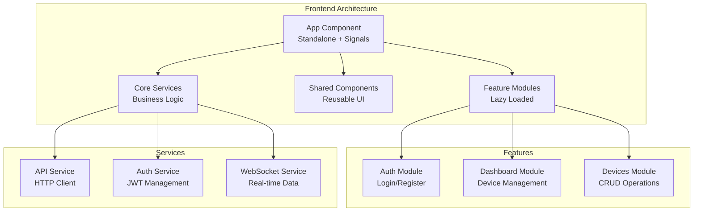

# IoT Device Manager - Frontend

<div align="center">


**A modern Angular 20 frontend application showcasing the latest features including Signals, Zoneless Change Detection, Server-Side Rendering, and Standalone Components for the IoT Device Manager system.**

[](https://angular.dev/tools/cli)
[](https://angular.dev/guide/ssr)
[](https://angular.dev/guide/signals)

</div>

---

## 🗺️ Table of Contents

- [🚀 Quick Start](#-quick-start)
- [🏗️ Architecture](#️-architecture)
- [⚡ Angular 20 Features](#-angular-20-features)
- [🎨 UI Components](#-ui-components)
- [🔧 Development](#-development)
- [📱 Responsive Design](#-responsive-design)
- [🧪 Testing](#-testing)
- [📚 Additional Resources](#-additional-resources)

---

## 🚀 Quick Start

### Prerequisites

- **Node.js 24+** (LTS)
- **npm 11+**
- **Angular CLI 20.3.6+**

### 🎯 One-Command Setup

```bash
# Navigate to frontend directory
cd packages/frontend

# Install dependencies
npm install

# Start development server
npm start
```

**That's it!** 🎉 The application will:
- ✅ Start on `http://localhost:4200`
- ✅ Enable hot reload for development
- ✅ Connect to backend services
- ✅ Provide real-time WebSocket updates

### 🌐 Access Points

| Service | URL | Description |
|---------|-----|-------------|
| **Frontend** | http://localhost:4200 | Angular 20 Dashboard |
| **API Gateway** | http://localhost:3000 | Backend API |
| **WebSocket** | ws://localhost:3003 | Real-time updates |

---

## 🏗️ Architecture

### Modern Angular 20 Structure



### 📁 Project Structure

```
src/
├── app/
│   ├── app.config.ts          # Application configuration
│   ├── app.routes.ts          # Route definitions
│   ├── app.ts                 # Root component (Standalone)
│   ├── core/                  # Core services
│   │   └── services/
│   │       ├── api.service.ts
│   │       ├── auth.service.ts
│   │       └── websocket.service.ts
│   ├── features/              # Feature modules
│   │   ├── auth/
│   │   │   └── login.component.ts
│   │   ├── dashboard/
│   │   │   └── dashboard.component.ts
│   │   └── devices/
│   │       └── services/
│   │           └── device.service.ts
│   └── shared/                # Shared components
│       └── components/
│           ├── badge/
│           ├── button/
│           ├── card/
│           └── input/
├── environments/
│   └── environment.ts         # Environment configuration
└── styles.scss               # Global styles
```

---

## ⚡ Angular 20 Features

### 🎯 Signals for Reactive State

$${\color{#AC3097}Modern \space \color{#56565E}Reactive \space Programming}$$

```typescript
// Using signals for reactive state management
export class DashboardComponent {
  deviceService = inject(DeviceService);
  
  // Computed signals for derived state
  onlineDevices = computed(() => 
    this.deviceService.devices().filter(d => d.status === 'online').length
  );
  
  // Effect for side effects
  constructor() {
    effect(() => {
      console.log('Devices updated:', this.deviceService.devices().length);
    });
  }
}
```

**Benefits:**
- **Fine-grained reactivity** - Only update what changed
- **Better performance** - No unnecessary change detection cycles
- **Simpler mental model** - Clear data flow
- **Type safety** - Full TypeScript support

### 🚀 Zoneless Change Detection

$${\color{#AC3097}Performance \space \color{#56565E}Optimization}$$

```typescript
// app.config.ts
export const appConfig: ApplicationConfig = {
  providers: [
    provideZonelessChangeDetection(), // Enable zoneless mode
    // ... other providers
  ]
};
```

**Features:**
- **No Zone.js dependency** - Smaller bundle size
- **Better performance** - Reduced overhead
- **Predictable updates** - Manual change detection control
- **Modern approach** - Future-proof architecture

### 🏗️ Standalone Components

$${\color{#AC3097}Modern \space \color{#56565E}Component \space Architecture}$$

```typescript
@Component({
  selector: 'app-dashboard',
  standalone: true, // No NgModule required
  imports: [CommonModule, RouterModule, ButtonComponent, CardComponent],
  template: `...`,
  styles: [`...`]
})
export class DashboardComponent {
  // Component logic
}
```

**Advantages:**
- **Tree-shakable** - Only import what you use
- **Simpler structure** - No NgModule complexity
- **Better performance** - Smaller bundle sizes
- **Easier testing** - Isolated components

### 🔄 Server-Side Rendering (SSR)

$${\color{#AC3097}SEO \space \color{#56565E}and \space Performance}$$

```typescript
// angular.json - SSR configuration
"server": "src/main.server.ts",
"outputMode": "server",
"ssr": {
  "entry": "src/server.ts"
}
```

**Benefits:**
- **Better SEO** - Search engine friendly
- **Faster initial load** - Server-rendered content
- **Improved Core Web Vitals** - Better user experience
- **Progressive enhancement** - Works without JavaScript

### 🎨 Control Flow Syntax

$${\color{#AC3097}Modern \space \color{#56565E}Template \space Syntax}$$

```html
<!-- New control flow syntax -->
@if (deviceService.loading()) {
  <div class="loading">Loading devices...</div>
} @else if (deviceService.devices().length === 0) {
  <div class="empty">No devices found</div>
} @else {
  @for (device of deviceService.devices(); track device.id) {
    <app-device-card [device]="device" />
  }
}
```

**Features:**
- **Cleaner syntax** - More readable templates
- **Better performance** - Optimized rendering
- **Type safety** - Compile-time checks
- **Modern approach** - Future-proof templates

---

## 🎨 UI Components

### 🧩 Shared Component Library

$${\color{#AC3097}Reusable \space \color{#56565E}UI \space Components}$$

| Component | Description | Features |
|-----------|-------------|----------|
| **Button** | Interactive buttons | Variants, sizes, loading states |
| **Card** | Content containers | Glass effect, glow, floating |
| **Input** | Form inputs | Validation, error states |
| **Badge** | Status indicators | Variants, pulse animation |

### 🎭 Design System

$${\color{#AC3097}Consistent \space \color{#56565E}Visual \space Language}$$

- **CSS Custom Properties** - Themeable design tokens
- **SCSS Architecture** - Modular styling approach
- **Responsive Design** - Mobile-first approach
- **Dark/Light Theme** - Automatic theme switching
- **Animations** - Smooth transitions and micro-interactions

### 🌈 Visual Features

- **Glass morphism** - Modern glass-like effects
- **Gradient backgrounds** - Beautiful color transitions
- **Floating animations** - Subtle motion design
- **Glow effects** - Interactive visual feedback
- **Responsive grid** - Adaptive layouts

---

## 🔧 Development

### 📋 Available Scripts

$${\color{#AC3097}Development \space \color{#56565E}Commands}$$

```bash
# Development server
npm start                    # Start dev server (ng serve)
npm run build               # Build for production
npm run watch               # Build and watch for changes

# Testing
npm test                    # Run unit tests
npm run test:coverage       # Run tests with coverage

# SSR
npm run serve:ssr:frontend  # Serve SSR build
```

### 🛠️ Development Workflow

$${\color{#AC3097}Best \space \color{#56565E}Practices}$$

1. **Component Development**
   ```bash
   ng generate component feature-name/component-name --standalone
   ```

2. **Service Development**
   ```bash
   ng generate service core/services/service-name
   ```

3. **Route Configuration**
   ```typescript
   // Lazy loading with standalone components
   {
     path: 'dashboard',
     loadComponent: () => import('./features/dashboard/dashboard.component')
       .then(m => m.DashboardComponent)
   }
   ```

### 🔌 Backend Integration

$${\color{#AC3097}API \space \color{#56565E}Communication}$$

```typescript
// API Service with HTTP Client
@Injectable({ providedIn: 'root' })
export class ApiService {
  private http = inject(HttpClient);
  
  get<T>(endpoint: string): Observable<T> {
    return this.http.get<T>(`${this.apiUrl}${endpoint}`, {
      headers: this.getHeaders()
    });
  }
}
```

**Features:**
- **HTTP Interceptors** - Automatic token handling
- **Error Handling** - Centralized error management
- **Type Safety** - Full TypeScript support
- **Observable Patterns** - Reactive programming

### 🌐 WebSocket Integration

$${\color{#AC3097}Real-time \space \color{#56565E}Communication}$$

```typescript
// WebSocket Service for real-time updates
@Injectable({ providedIn: 'root' })
export class WebSocketService {
  private ws = signal<WebSocket | null>(null);
  connected = computed(() => this.ws() !== null);
  
  connect() {
    this.ws.set(new WebSocket('ws://localhost:3003'));
  }
}
```

---

## 📱 Responsive Design

### 📐 Breakpoint System

$${\color{#AC3097}Mobile-First \space \color{#56565E}Approach}$$

```scss
// Responsive breakpoints
@media (max-width: 768px) {
  .dashboard {
    padding: 1rem;
  }
  
  .devices-grid {
    grid-template-columns: 1fr;
  }
}
```

**Breakpoints:**
- **Mobile**: < 768px
- **Tablet**: 768px - 1024px
- **Desktop**: > 1024px

### 🎯 Adaptive Features

- **Flexible Grid Layouts** - CSS Grid with auto-fit
- **Responsive Typography** - Fluid text scaling
- **Touch-Friendly Interactions** - Optimized for mobile
- **Progressive Enhancement** - Works on all devices

---

## 🧪 Testing

### 🎯 Test Configuration

$${\color{#AC3097}Comprehensive \space \color{#56565E}Testing \space Strategy}$$

```bash
# Run tests
npm test

# Run tests with coverage
npm run test:coverage

# Run tests in watch mode
npm test -- --watch
```

### 📋 Testing Approach

- **Unit Tests** - Component and service testing
- **Integration Tests** - Feature testing
- **E2E Tests** - Full application testing
- **Visual Regression** - UI consistency testing

### 🛠️ Testing Tools

- **Jasmine** - Testing framework
- **Karma** - Test runner
- **Angular Testing Utilities** - Component testing
- **RxJS Testing** - Observable testing

---

## 📚 Additional Resources

### 🎓 Learning Resources

- **[Angular 20 Documentation](https://angular.dev)** - Official Angular guide
- **[Signals Guide](https://angular.dev/guide/signals)** - Reactive programming
- **[SSR Guide](https://angular.dev/guide/ssr)** - Server-side rendering
- **[Standalone Components](https://angular.dev/guide/standalone-components)** - Modern architecture

### 🔗 Related Documentation

- **[Root README](../README.md)** - Project overview
- **[API Documentation](../docs/API.md)** - Backend API reference
- **[Architecture Guide](../ARCHITECTURE.md)** - System architecture

### 🎯 Key Learning Demonstrations

This frontend showcases:

1. **Angular 20 Features** - Latest framework capabilities
2. **Signals** - Modern reactive programming
3. **Zoneless Change Detection** - Performance optimization
4. **Standalone Components** - Modern architecture
5. **Server-Side Rendering** - SEO and performance
6. **TypeScript 5** - Advanced type safety
7. **Responsive Design** - Mobile-first approach
8. **Real-time Updates** - WebSocket integration
9. **Component Architecture** - Reusable UI components
10. **Modern CSS** - SCSS and custom properties

---

## 🤝 Contributing

### 🚀 Development Guidelines

1. **Follow Angular Style Guide** - Official best practices
2. **Use Standalone Components** - Modern architecture
3. **Implement Signals** - Reactive state management
4. **Write Tests** - Comprehensive test coverage
5. **Responsive Design** - Mobile-first approach

### 📋 Code Standards

- **TypeScript Strict Mode** - Type safety
- **ESLint Configuration** - Code quality
- **Prettier Formatting** - Consistent style
- **Conventional Commits** - Clear commit messages

---

<div align="center">

**Built with ❤️ using Angular 20, TypeScript 5, and modern web technologies**

[](https://angular.dev)
[](https://www.typescriptlang.org/)

---

⭐ **Star this repository if you found it helpful!**

</div>
